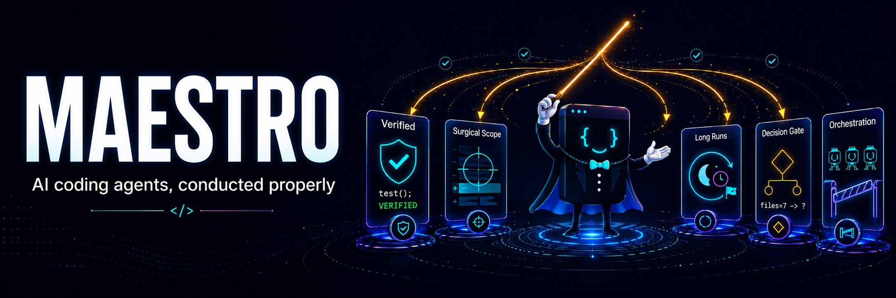

<p align="center">
  
</p>

<p align="center">
  A discipline layer for AI coding agents: verified done-claims, surgical scope, long-run guardrails, and multi-agent orchestration held behind a research-backed gate
</p>

<p align="center">
  <a href="https://opensource.org/licenses/MIT"></a>
  
  
</p>

<p align="center">
  <sub>13 fixture tasks &middot; 84 valid A/B runs &middot; 0 voids &middot; 5 hooks, all tested &middot; ~10 KB doctrine &middot; 2 files to install</sub>
</p>

---

Maestro installs as plain markdown files your AI agent reads on startup. No packages, no build steps, no SDK. Download the files for your runtime into the project root and your agent picks them up automatically.

| Runtime | Files to add |
|---|---|
| Claude Code | [`AGENTS.md`](AGENTS.md) + [`CLAUDE.md`](CLAUDE.md) |
| Gemini | [`AGENTS.md`](AGENTS.md) + [`GEMINI.md`](GEMINI.md) |
| Codex | [`AGENTS.md`](AGENTS.md); see [Maestro on Codex](docs/codex.md) |
| Cursor | [`.cursorrules`](.cursorrules) |
| GitHub Copilot | [`AGENTS.md`](AGENTS.md); nearest `AGENTS.md` in the directory tree wins, and a root `CLAUDE.md` or `GEMINI.md` also works |
| Cline | [`AGENTS.md`](AGENTS.md); native support (also auto-detects `.cursorrules`) |
| Windsurf | [`AGENTS.md`](AGENTS.md); root file is always-on, processed by the Rules engine |

Copy-paste install commands are in [Quick Start](#quick-start) below.

> **Already have a `CLAUDE.md`, `AGENTS.md`, or `.cursorrules`?** Don't overwrite them, you'll lose your project context. See [Quick Start](#quick-start) for how to merge Maestro into your existing setup.

## What You Get

Drop two markdown files into your repo and your agent gains five things:

1. **Done means done.** Completion reports must carry a verification
   status (`VERIFIED` / `UNVERIFIED` / `FAIL`) backed by an actual
   type-check, lint, or test run, and an optional hook enforces it
   structurally. No more "All done!" on code that was never run.
2. **It stays in its lane.** Surgical-scope rules: every changed line
   traces back to what you asked for. No drive-by refactors, no
   formatting sweeps, no "improvements" you didn't request, no
   deleting code it couldn't verify was dead.
3. **Long runs that land.** Overnight tasks and recurring loops get
   checkpoint artifacts, explicit end conditions, iteration caps, and
   re-grounding rules: the difference between an agent that ships at
   6am and one that drifted off-goal at 2am. This repo's own benchmark
   loops run on exactly these rules.
4. **Multi-agent only when it pays.** A counted Decision Gate routes
   work single-agent by default and demands an explicit verdict line
   before the first edit. Orchestration (Planner, Specialists,
   adversarial Staff-Engineer review) stays behind the gate, reserved
   for work genuinely too big for one pass.
5. **Receipts.** A reproducible A/B benchmark harness ships in-repo,
   and the results below include our own retractions and nulls. You
   can see exactly what is proven and what is open, then rerun every
   number yourself.

What that looks like at the close of a run, quoted verbatim from the
committed benchmark streams:

<p align="center">
  
</p>

The price, measured rather than implied: ON spends about 10% more
than a clean agent on a 10-module refactor and 38% more on a 16-file
feature (n=9 medians, t08/t12 below). You are buying verification
and auditability, not speed.

Maestro also runs under its own rules. The two most recent
maintenance loops ran unattended overnight on the S10 long-horizon
doctrine: checkpoint artifacts, pre-declared budget ceilings, dual
termination. Together they made 48 benchmark runs for $17.16 against
a $25 cap, produced 0 voided runs, and shipped the retractions you
can read below with no human in the loop.

Maestro is built on [peer-reviewed research](https://marklaursen.com/blog/why-your-multi-agent-ai-system-keeps-failing) showing that **79% of multi-agent failures come from coordination breakdowns, not model capability**, and that **three optimized agents outperform seven**.

## Why Maestro Exists

Most multi-agent frameworks add agents to make things faster. The research says the opposite: adding agents usually makes things worse.

| Finding | Source |
|---|---|
| Multi-agent systems fail 41-87% of the time | [MAST](https://arxiv.org/abs/2503.13657), NeurIPS 2025 |
| 79% of failures come from coordination, not capability | [MAST](https://arxiv.org/abs/2503.13657), NeurIPS 2025 |
| 3 optimized agents outperform 7 (53-68% cost reduction) | [DyLAN](https://arxiv.org/abs/2310.02170), COLM 2024 |
| Sequential reasoning degrades 39-70% under multi-agent | [Scaling Agent Systems](https://arxiv.org/abs/2512.08296) (Google/MIT), 2025 |
| Architecture-task fit, not agent count, predicts multi-agent gains | [Scaling Agent Systems](https://arxiv.org/abs/2512.08296) (Google/MIT), 2025 |

Maestro is built on that restraint. It makes the single agent you already have rigorous by default (verification, scope, honest reporting) and holds multi-agent coordination behind a counted gate until a task actually demands it. Per the research above, restraint is the orchestration decision with the most evidence behind it.

## Architecture

<p align="center">
  
</p>

**Universal Rules (the discipline core):** Verification gates, status vocabulary, surgical scope, edit safety, and context economy, applied to every task in both modes. This is the part of Maestro working on every prompt, including the one-line fixes.

**Decision Gate:** Routes each task to single-agent or multi-agent execution based on complexity, parallelizability, and token cost. The gate counts the work and emits an explicit verdict line (`GATE: files=<n> concerns=<m> -> ...`) before the first edit. Most tasks stay single-agent.

**Planner:** Decomposes complex tasks into parallel and sequential subtasks with clear boundaries and acceptance criteria.

**Specialists:** Execute focused subtasks with scoped context, hard-capped at 4 per parallel group based on the DyLAN and agent-scaling findings.

**Cross-Talk Routing:** Detects when one specialist's output affects another and routes the minimum necessary context between them.

**Staff Engineer Review:** Performs adversarial final verification to catch contradictions, breakage, and architectural drift.

**Long-Horizon Operation:** Checkpoint artifacts, self-pacing, and explicit end conditions govern recurring or multi-session autonomous runs (Section 10 of the doctrine, including the Loop Engineering rules):

<p align="center">
  
</p>

The specialist manifest (S3) and cross-talk handoff packet (S4/S6) also ship as optional machine-readable JSON Schemas in [`schemas/`](schemas/) for tooling and validation. The prose doctrine remains the source of truth.

## Quick Start

### Claude Code

**Option A, plugin (hooks + context-bar command, one step).** Maestro
is an installable Claude Code plugin; the repo is its own marketplace:

```text
/plugin marketplace add mbanderas/maestro
/plugin install maestro@maestro
```

The plugin auto-wires all five enforcement hooks (subagent guard, loop
guard, phase-scope guard, gate reminder, opt-in gate telemetry) and the
`/maestro:context-bar` command. Two things it cannot do for you:
the doctrine files (`AGENTS.md`/`CLAUDE.md`) still go in your project
root (Option B), and the status line script still needs a one-line
`statusLine` settings entry (see [Context Bar](#claude-code-context-bar))
— plugins cannot set the main status line.

**Option B, plain files (doctrine only, zero machinery):**

```bash
curl -O https://raw.githubusercontent.com/mbanderas/maestro/main/AGENTS.md
curl -O https://raw.githubusercontent.com/mbanderas/maestro/main/CLAUDE.md
```

Claude Code reads `CLAUDE.md` on startup. The `@AGENTS.md` import inside it pulls in the orchestration doctrine. Your next task routes through Maestro's Decision Gate.

**Already have a `CLAUDE.md`?** Don't overwrite it. Instead, download just `AGENTS.md` and add `@AGENTS.md` to the top of your existing `CLAUDE.md` to import the doctrine. You can optionally merge the runtime rules from Maestro's [`CLAUDE.md`](CLAUDE.md) into yours.

**Optional:** Maestro also ships a context-window progress bar for the Claude Code status line; see [Context Bar](#claude-code-context-bar).

### Gemini

```bash
curl -O https://raw.githubusercontent.com/mbanderas/maestro/main/AGENTS.md
curl -O https://raw.githubusercontent.com/mbanderas/maestro/main/GEMINI.md
```

**Already have a `GEMINI.md`?** Don't overwrite it. Download just `AGENTS.md` and add `@AGENTS.md` to the top of your existing `GEMINI.md`. You can optionally merge the runtime rules from Maestro's [`GEMINI.md`](GEMINI.md) into yours.

### Codex

```bash
curl -O https://raw.githubusercontent.com/mbanderas/maestro/main/AGENTS.md
```

Codex reads `AGENTS.md` directly; no adapter file needed.

**Already have an `AGENTS.md`?** Don't overwrite it: that file likely contains your project context. Instead, append the contents of Maestro's [`AGENTS.md`](AGENTS.md) to your existing file, or paste it into a section of your `AGENTS.md` so Codex reads both your project context and the orchestration doctrine.

### Cursor

```bash
curl -O https://raw.githubusercontent.com/mbanderas/maestro/main/.cursorrules
```

**Already have a `.cursorrules`?** Don't overwrite it. Cursor does not support file imports, so append the contents of Maestro's [`.cursorrules`](.cursorrules) to your existing file.

## How It Works

1. You give your AI coding agent a task as normal
2. The **Decision Gate** counts the work and emits a verdict line. Most tasks run single-agent, carrying the full discipline layer with no coordination overhead
3. Single-agent work follows the **Universal Rules**: scoped edits, verification before any completion claim, an honest status token at the end
4. For work that crosses the gate's thresholds, the **Planner** decomposes it, **Specialists** execute with scoped context, and the **Staff Engineer** reviews adversarially
5. Long or recurring runs follow the **Long-Horizon rules**: checkpoint artifacts, explicit end conditions, iteration caps
6. You get a result with a verification status you can act on, not a vibe

## Context Architecture

Maestro minimizes token cost through progressive context loading: agents start from the smallest artifact that can orient their work and expand to live code only when needed.

**Orientation artifacts:** Optional project maps or subsystem indexes that give the Planner and Specialists a cheap structural overview before reading code. Workers start from narrow context instead of rediscovering the repo from scratch.

**Blast-radius-aware routing:** The Decision Gate considers file centrality when choosing execution mode. Tasks touching dependency hubs (shared interfaces, core modules) bias toward single-agent or tighter review. Tasks isolated in narrow subsystems decompose more safely.

**Index-first retrieval:** When a verified orientation artifact exists, agents read it before broad file discovery. This eliminates repeated repo exploration across specialists, one of the largest sources of wasted tokens in multi-agent workflows.

**Orientation is not authority:** Generated maps and project indexes are navigation aids, not source of truth. Agents always verify against live code before acting, preventing stale context from becoming silent corruption.

These features follow the same principle as the rest of Maestro: reducing coordination cost and context duplication is more effective than adding capability.

## Runtime Adapters

Maestro separates **portable orchestration doctrine** from **runtime-specific adapters**. The core logic (Decision Gate, Planner, Specialists, Cross-Talk, Staff Engineer, Universal Rules, Compression) lives in `AGENTS.md` and works across any agent runtime.

Runtime adapters are thin wrappers that import the shared doctrine and add only what is specific to that runtime:

| File | Role | What it adds |
|---|---|---|
| `AGENTS.md` | Portable core | Full orchestration doctrine, runtime-agnostic |
| `CLAUDE.md` | Claude Code adapter | Subagent/team routing, hooks, context limits, tool scoping, long-horizon mapping (/loop, schedules) |
| `GEMINI.md` | Gemini adapter | Execution mapping, instruction precedence, verification notes, long-horizon note |
| `.cursorrules` | Cursor adapter | Full doctrine (Cursor does not support imports) |
| [`docs/codex.md`](docs/codex.md) | Codex guide | AGENTS.md precedence and 32 KiB cap, Automations long-horizon mapping (no separate adapter file; Codex reads `AGENTS.md` natively) |

GitHub Copilot, Cline, and Windsurf read `AGENTS.md` directly (verified
against their official docs, 2026-06-10), so the portable core works
there with no adapter. Runtime-specific niceties (hooks, context bar,
long-horizon loop commands) remain Claude Code features. Maestro's
`AGENTS.md` is ~10 KB, under Windsurf's 12,000-character workspace
rule limit and roughly a third of Codex's default 32 KiB instruction
budget.

**Design principle:** runtime-specific features stay in adapters unless they generalize across environments. This keeps the shared doctrine portable and prevents provider-specific details from bloating the core files.

Adding a new runtime adapter means creating a thin file that imports `AGENTS.md` and maps Maestro concepts to the runtime's capabilities.

### Claude Code: Subagents vs Agent Teams

Claude Code offers two mechanisms for parallel work, subagents and [agent teams](https://code.claude.com/docs/en/agent-teams), and Maestro's `CLAUDE.md` adapter automatically routes to the right one based on the task:

- **Subagents** run within a single session: they execute a scoped task and report results back to the parent agent. Maestro defaults to subagents for most parallel work, narrow independent tasks where only the result matters.
- **[Agent teams](https://code.claude.com/docs/en/agent-teams)** coordinate multiple independent Claude Code sessions with shared task lists and direct inter-agent messaging. Unlike subagents, teammates communicate peer-to-peer and self-coordinate. Maestro routes to agent teams only when peer-to-peer coordination is materially useful: long-running parallel workstreams, competing-hypothesis debugging, or cross-layer feature builds where agents need to discuss and challenge each other's work.

This routing is automatic. Maestro's Decision Gate evaluates the task, and the Claude adapter selects the execution mode: subagents by default, teams only when the collaboration overhead is justified by the task's complexity.

Agent teams are **experimental and Claude Code-only**; they are not available in Gemini, Codex, Cursor, or other runtimes. Maestro's portable core uses the general concept of "specialists" which each runtime maps to its own execution model.

### Claude Code: Verification Hook

Maestro ships an optional `SubagentStop` hook for Claude Code that
enforces the Section 7.3 verification rule structurally: no prompt
reminder, no relying on the model to police itself. When a subagent
stops, the hook checks three things and emits a soft warning if any
fails:

1. Are there orphaned `background_tasks` still active? If so, the
   subagent is declaring complete while work is still running. Scoped
   to agents whose transcript shows they spawned background work —
   the payload field is machine-wide, and unrelated sessions' tasks
   must not nag an agent that spawned nothing.
2. Did a file-modifying subagent run a type-checker, linter, or test
   runner? If not, it likely skipped verification.
3. Does a file-modifying subagent's final report carry one of the
   Section 7.3 status tokens (`VERIFIED` / `PENDING_REVIEW` /
   `UNVERIFIED` / `FAIL`)? Uppercase only; lowercase "verified" in
   prose is not a status declaration.

Three safety properties keep the warning from doing more harm than
good (a warning on stop extends the subagent's turn, so a careless
guard can displace the final report the orchestrator is waiting for):

- **Read-only agents are exempt.** Explore/Plan agent types, or any
  agent whose transcript shows no `Edit`/`Write`/`NotebookEdit` calls
  and no recognizable Bash mutation (e.g. `git commit`), have nothing
  to verify and are never warned.
- **Fires at most once per agent.** The warning re-prompts the agent,
  which stops again and re-triggers the hook; without a once-guard
  the loop pushes the real report out of the final message.
- **The report survives.** The warning text tells the agent to restate
  its complete final report, since only the last message is returned
  to the orchestrator.

The hook never blocks. It injects `additionalContext` so the next
turn sees the warning and can re-verify. Recognized tools include
`tsc --noEmit`, `eslint`, `pytest`, `jest`, `vitest`, `go test`,
`cargo test`, `npm/pnpm/yarn test`, `ruff check`, `mypy`,
`prettier --check`, and `biome check`.

The file ships as `.cjs` so Node treats it as CommonJS even if a
`"type": "module"` package.json exists somewhere above your
`~/.claude/hooks/` directory. Tests live next to it; run
`node hooks/maestro-subagent-guard.test.cjs` from the repo root.

**Install:** download into `~/.claude/hooks/` and wire into
`~/.claude/settings.json`:

```bash
mkdir -p ~/.claude/hooks
curl -o ~/.claude/hooks/maestro-subagent-guard.cjs https://raw.githubusercontent.com/mbanderas/maestro/main/hooks/maestro-subagent-guard.cjs
```

Add a `SubagentStop` entry under `hooks` in `~/.claude/settings.json`
(merge with any existing hooks block):

```jsonc
"hooks": {
  "SubagentStop": [
    {
      "matcher": "",
      "hooks": [
        {
          "type": "command",
          "command": "node \"/absolute/path/to/.claude/hooks/maestro-subagent-guard.cjs\""
        }
      ]
    }
  ]
}
```

On Windows, use the absolute path with escaped backslashes, e.g.
`"C:\\Users\\you\\.claude\\hooks\\maestro-subagent-guard.cjs"`.

The hook requires Claude Code 2.1.145 or later; earlier versions do
not include `background_tasks` in the `SubagentStop` payload. The
`agent_type` and `agent_transcript_path` fields it reads were added
earlier (2.1.69 and 2.0.42); when absent the hook degrades gracefully
and simply warns less.

### Claude Code: Hook Pack

Four more optional hooks enforce other Maestro rules structurally.
Same engineering rules as the verification hook: plain Node `.cjs`,
zero dependencies, soft warnings only (never block), fire-once guards,
graceful degradation on missing payload fields. Tests live next to
each hook (`node hooks/<name>.test.cjs`).

| Hook | Event | Enforces |
|---|---|---|
| `maestro-loop-guard.cjs` | `Stop` | S10 long-horizon: warns when a looping session (session crons or `ScheduleWakeup` calls) has no `_<task>.md` checkpoint artifact in the working directory, or exceeds the iteration cap (`MAESTRO_LOOP_MAX_ITER`, default 50) |
| `maestro-phase-scope.cjs` | `PostToolUse` | S7.1 phase scope: warns when more than 5 distinct files (`MAESTRO_PHASE_FILE_CAP`) are modified in a single turn |
| `maestro-gate-reminder.cjs` | `UserPromptSubmit` | S1 gate: injects the counted-verdict checklist on the first prompt of a session (fire-once; opt-out via `MAESTRO_GATE_REMINDER=0`) |
| `maestro-gate-telemetry.cjs` | `SessionEnd` | S1 audit (opt-in): logs one JSON line per session with gate decision (single/multi), specialist count, end reason |

**Privacy (gate telemetry):** the telemetry hook does nothing unless
you set `MAESTRO_TELEMETRY=1`. When enabled it appends to
`~/.claude/maestro-telemetry.jsonl` on your machine: counts, the end
reason, and the project folder *name* only. No prompts, no file
contents, no full paths, no network, ever.

**Install:** download into `~/.claude/hooks/`:

```bash
curl -o ~/.claude/hooks/maestro-loop-guard.cjs https://raw.githubusercontent.com/mbanderas/maestro/main/hooks/maestro-loop-guard.cjs
curl -o ~/.claude/hooks/maestro-phase-scope.cjs https://raw.githubusercontent.com/mbanderas/maestro/main/hooks/maestro-phase-scope.cjs
curl -o ~/.claude/hooks/maestro-gate-reminder.cjs https://raw.githubusercontent.com/mbanderas/maestro/main/hooks/maestro-gate-reminder.cjs
curl -o ~/.claude/hooks/maestro-gate-telemetry.cjs https://raw.githubusercontent.com/mbanderas/maestro/main/hooks/maestro-gate-telemetry.cjs
```

Wire into `~/.claude/settings.json` (merge with any existing `hooks`
block; use absolute paths, escaped backslashes on Windows):

```jsonc
"hooks": {
  "Stop": [
    { "matcher": "", "hooks": [
      { "type": "command", "command": "node \"/absolute/path/to/.claude/hooks/maestro-loop-guard.cjs\"" }
    ]}
  ],
  "PostToolUse": [
    { "matcher": "Edit|Write|NotebookEdit", "hooks": [
      { "type": "command", "command": "node \"/absolute/path/to/.claude/hooks/maestro-phase-scope.cjs\"" }
    ]}
  ],
  "UserPromptSubmit": [
    { "matcher": "", "hooks": [
      { "type": "command", "command": "node \"/absolute/path/to/.claude/hooks/maestro-gate-reminder.cjs\"" }
    ]}
  ],
  "SessionEnd": [
    { "matcher": "", "hooks": [
      { "type": "command", "command": "node \"/absolute/path/to/.claude/hooks/maestro-gate-telemetry.cjs\"" }
    ]}
  ]
}
```

The loop guard reads the `session_crons` Stop-payload field and Stop
`additionalContext` output, both available in current Claude Code
releases (see the Claude Code changelog); on older versions it simply
stays silent.

### Claude Code: Context Bar

Maestro ships an optional status line for Claude Code: a context-window progress bar showing how much of the model's context is used.

```text
████████░░░░░░░░░░░░ 42% 84k/200k · my-project
```

The bar updates live, shifts from green to amber to red as context fills, and detects the model's context window automatically, including the 1M-token Opus tier. It is **enabled by default** once installed.

**Install** on Windows / PowerShell:

```powershell
mkdir ~/.claude/statusline, ~/.claude/commands -Force
curl -o ~/.claude/statusline/context-bar.ps1 https://raw.githubusercontent.com/mbanderas/maestro/main/statusline/context-bar.ps1
curl -o ~/.claude/commands/context-bar.md https://raw.githubusercontent.com/mbanderas/maestro/main/commands/context-bar.md
```

**Install** on macOS / Linux (the bar requires [`jq`](https://jqlang.github.io/jq/); without it the status line shows the folder name only):

```bash
mkdir -p ~/.claude/statusline ~/.claude/commands
curl -o ~/.claude/statusline/context-bar.sh https://raw.githubusercontent.com/mbanderas/maestro/main/statusline/context-bar.sh
curl -o ~/.claude/commands/context-bar.md https://raw.githubusercontent.com/mbanderas/maestro/main/commands/context-bar.md
chmod +x ~/.claude/statusline/context-bar.sh
```

Then point Claude Code at the script by adding a `statusLine` block to `~/.claude/settings.json` (use the **absolute path** to the script):

```jsonc
// Windows
"statusLine": {
  "type": "command",
  "command": "powershell -NoProfile -ExecutionPolicy Bypass -File \"C:\\Users\\you\\.claude\\statusline\\context-bar.ps1\""
}

// macOS / Linux
"statusLine": {
  "type": "command",
  "command": "bash /Users/you/.claude/statusline/context-bar.sh"
}
```

**Enable / disable:** the bar is on by default. Toggle it with the `/context-bar` slash command:

| Command | Effect |
|---|---|
| `/context-bar` | Toggle on/off |
| `/context-bar off` | Disable; status line shows the folder name only |
| `/context-bar on` | Re-enable |

The toggle is a flag file (`.context-bar-disabled`) next to the script. No settings edit, no restart. The change applies on the next status line refresh.

**Codex CLI:** this script does not apply. Codex CLI has no command-backed
status line; it only renders a fixed set of built-in items. It already
ships a native context-usage indicator. Enable it with the `/statusline`
picker, or set `context` in the `[tui].status_line` list in
`~/.codex/config.toml`.

## When to Use Maestro

The discipline layer (verification, scope, honest status) applies to
every task from a one-line fix upward. The orchestration path helps
most on tasks that are:

- **Genuinely too complex for one pass:** large refactors, multi-file features, cross-cutting concerns
- **Parallelizable:** independent subtasks that don't need sequential reasoning
- **Benefiting from adversarial review:** where a second perspective catches issues

The orchestration path is intentionally **avoided** where:

- A single agent already handles it well (the Decision Gate blocks unnecessary multi-agent)
- The work is purely sequential reasoning (planning, step-by-step proofs)
- The task involves fewer than ~10 files

This is by design. The research shows coordination overhead makes
simple tasks worse, not better. On those tasks Maestro contributes
the discipline layer and deliberately nothing else.

## Why Not CrewAI / LangGraph / AutoGen?

| | Maestro | CrewAI / LangGraph / AutoGen |
|---|---|---|
| **Setup** | Copy 1-2 files, done | Install packages, write Python/TS, configure agents |
| **Dependencies** | Zero | Framework + SDK + runtime |
| **Where it runs** | Inside your existing AI coding agent | Standalone process you build and deploy |
| **Agent count** | Hard cap at 4 parallel (research-backed) | Unlimited (user decides) |
| **Default behavior** | Single-agent unless complexity warrants multi | Always multi-agent |
| **Design philosophy** | Fewer agents, structured coordination | More agents, flexible topologies |

Maestro is not a framework. It's a discipline-and-orchestration layer for AI coding agents that already exist. You don't write agent code. You copy a couple of files and your existing agent gains verification rigor, scope discipline, and gated multi-agent capabilities.

If you need a standalone multi-agent application with custom tools, APIs, and deployment pipelines, use a framework. If you want your AI coding agent to handle complex tasks better without changing your workflow, use Maestro.

## Benchmarks

Maestro ships a reproducible A/B harness in [`benchmarks/`](benchmarks/):
thirteen fixture tasks (single-file fixes through hidden-invariant
features, a 19-file validation sweep, a multi-concern subsystem
with a deliberately underspecified spec, and a trap-convention tier
with code-only invariants), a zero-dependency
runner for Windows and macOS/Linux, and a deterministic `verify.cjs`
checker per task. Each task runs with Maestro ON (doctrine files in
the work dir) vs OFF (absent), under an isolated `CLAUDE_CONFIG_DIR`
so global config cannot contaminate either cell, and the checker stays
**hidden from the agent until the run ends** (visible oracles inflate
pass rates 20-60%, arXiv:2602.10975). Protocol, scoring rubric, and
Codex/Gemini recipes: [`benchmarks/README.md`](benchmarks/README.md).

Current cells (Claude Code, `sonnet`, hidden-oracle runner,
2026-06-10/11; medians of valid runs, voided CLI-error runs excluded
and documented):

<p align="center">
  
</p>

| Cell | n | Pass | Med wall | Med turns | Med cost | Med out-tok |
|---|---|---|---|---|---|---|
| t07 OFF | 3 | 3/3 | 70s | 12 | $0.164 | 2,421 |
| t07 ON | 3 | 3/3 | 71s | 15 | $0.228 | 2,799 |
| t08 OFF | 9 | 9/9 | 80s | 24 | $0.230 | 4,467 |
| t08 ON | 9 | 9/9 | 59s | 25 | $0.253 | 4,411 |
| t09 OFF | 9 | 8/9 | 147s | 19 | $0.287 | 5,160 |
| t09 ON | 9 | 8/9 | 143s | 18 | $0.315 | 5,478 |
| t09 CORE | 6 | 6/6 | 137s | 20.5 | $0.345 | 5,231 |
| t10 OFF | 5 | 5/5 | 29s | 6 | $0.101 | 1,607 |
| t10 ON | 5 | 5/5 | 51s | 9 | $0.169 | 2,949 |
| t11 OFF | 1 | 1/1 | 238s | 37 | $0.507 | 12,924 |
| t11 ON | 1 | 1/1 | 201s | 37 | $0.533 | 9,905 |
| t12 OFF | 9 | 9/9 | 175s | 21 | $0.343 | 6,529 |
| t12 ON | 9 | 9/9 | 143s | 25 | $0.475 | 6,882 |

Three further claims were measured on 2026-06-10, then re-measured at
higher n (t12 and t08 topped up to n=9 per mode, a purpose-built
trap-convention task probed three times on haiku, a two-turn
interactive-proxy probe, and three Decision-Gate activation probe
cycles on 2026-06-11; 84 valid runs across the three loops, 0
voids):

- **Weak-model rescue: not measurable, now with stronger evidence.**
  Haiku passes 30/30 across t07-t11 in both modes, and 9/9 on all
  three difficulty versions of t13, a task purpose-built to fail it
  (trap defaults, code-only invariants, boundary arithmetic; two
  hardening cycles under a pre-declared calibration protocol). A
  haiku-4.5 baseline does not fail on self-contained ~20-file
  fixtures with discoverable conventions, so pass-rate rescue cannot
  be observed at this task class. (Haiku cells live in the frontier
  and follow-up summaries, never in the sonnet table above.)
- **The multi-agent path (S2-S6) still never fires, but the gate now
  speaks.** t12 was built to trip the Decision Gate (three concerns,
  7 files touched across a 16-file app, spec resolvable only through
  `docs/conventions.md`). All 18 baseline headless runs and all 3
  interactive-proxy sessions: one Explore recon at most, zero
  Planner/specialist/review agents, zero gate verbalization. Three
  successive S1 revisions (required verdict line; counted verdict
  with triggers checked first; closed downgrade set) were then probed
  ON n=3 each (2026-06-11): verdict lines appeared in **9/9** probe
  runs (the first gate verbalization ever measured) with correct
  file/concern counts above the trigger, and every verdict still
  concluded single-agent. S2-S6 spawns: **0/9**. Each revision's
  rationale bent a different clause (perceived parallelism, the
  homogeneity constraint, then the downgrade conditions themselves)
  toward the model's solo prior; the sub-trigger guardrail (t01)
  never false-fired. Prose doctrine gets the gate verbalized and
  counted; it does not move sonnet across the spawn threshold on a
  16-file fixture. Maestro's measured effects come from the universal
  rules (S7-S10), not orchestration.
- **Compliance deltas are null at these tiers.** Three runs in 69
  scored streams stated a S7.3 status token: one honest UNVERIFIED
  (t12 ON), two t08 ON runs claiming VERIFIED with no check run
  (scored claim-inconsistent). Surgical scope and oracle integrity
  remain perfect in both modes. Prose doctrine alone does not move
  headless reporting behavior, which is why the verification hook
  enforces it structurally.

Honest reading: **Maestro ON has never beaten OFF on success rate in
any measured cell**: at n=9 t09 is exactly tied (8/9 each) and t08
and t12 are 9/9 both modes. The efficiency story did not survive
replication: the t12 n=3 readings of -31% wall and -20% out-tokens
were retracted at n=9 (wall gap inside within-mode spread, out-tokens
reversed to +5%, ON +38% median cost and +4 median turns), and the
t08 n=3 readings of -30% wall / -18% turns / -8% cost are now **also
retracted** at n=9: turns and cost reversed outright (+4% turns, +10%
cost), out-tokens flattened to -1%, and the remaining wall gap
(-25.5%, 20.3s) sits inside the OFF cell's own 47.4s run-to-run
range. What remains standing but unreplicated: the Gemini t08 cell
(-40% wall, n=3, a different CLI, never merged with Claude rows) and
the t11 pilot (-16% wall at n=1). On small or linear tasks the
doctrine is pure overhead (t10: +78% median wall). t09 separates
*models* more than modes: gemini-3.1-pro-preview passes 1 of 6 valid
runs, gpt-5.4-mini passes 4/4, sonnet ~8-in-9. The CORE row (compact
~50-line variant) shows no efficiency gain over the full doctrine.
Small samples throughout; no significance claims. Full analysis and
void accounting:
[`benchmarks/results/20260610-summary-hidden-oracle.md`](benchmarks/results/20260610-summary-hidden-oracle.md),
[`benchmarks/results/20260610-summary-xcli.md`](benchmarks/results/20260610-summary-xcli.md),
[`benchmarks/results/20260610-summary-frontier.md`](benchmarks/results/20260610-summary-frontier.md),
[`benchmarks/results/20260610-summary-followup.md`](benchmarks/results/20260610-summary-followup.md),
and
[`benchmarks/results/20260611-summary-activation.md`](benchmarks/results/20260611-summary-activation.md).

Post-fix Gemini (`gemini-3.1-pro-preview`) and Codex (`gpt-5.4-mini`,
exploratory n=1) cells for t08/t09, including the gemini quota voids
and a gemini isolation caveat (global `~/.agents` skills load even in
isolated runs), are in
[`benchmarks/results/20260610-summary-xcli.md`](benchmarks/results/20260610-summary-xcli.md).
Earlier same-day results for t01-t06 (and the original Codex/Gemini
small-task cells) were measured **before** the hidden-oracle fix and
are kept as labeled upper bounds in
[`benchmarks/results/`](benchmarks/results/): the agent could read
the checker during those runs, so their pass rates are not comparable.
Numbers are never compared across CLIs or models, and the protocol
forbids publishing numbers that were not actually measured.

## Research Foundation

Maestro's architecture is grounded in 700+ sources across computer science, library science, safety engineering, and knowledge theory. The key papers:

| Paper | Year | Venue | Key Finding |
|---|---|---|---|
| [MAST](https://arxiv.org/abs/2503.13657) | 2025 | NeurIPS Spotlight | 41-87% failure rates; 79% from coordination |
| [DyLAN](https://arxiv.org/abs/2310.02170) | 2024 | COLM | 3 agents outperform 7; dynamic topology selection |
| [Towards a Science of Scaling Agent Systems](https://arxiv.org/abs/2512.08296) | 2025 | arXiv (Google/MIT) | 260 configs; architecture-task fit dominates; sequential tasks degrade 39-70% |
| [Agent Scaling via Diversity](https://arxiv.org/abs/2602.03794) | 2026 | arXiv | 2 diverse agents match 16 homogeneous; diversity, not headcount, drives gains |
| [LoopTrap](https://arxiv.org/abs/2605.05846) | 2026 | arXiv | Termination poisoning: loop end-conditions are an attack surface; hard caps mitigate |
| [MetaGPT](https://arxiv.org/abs/2308.00352) | 2023 | — | Structured handoffs score 3.9/4 vs unstructured 2.1/4 |
| [Voyager](https://arxiv.org/abs/2305.16291) | 2023 | NeurIPS | Skill library pattern for capability organization |
| [GTD](https://arxiv.org/abs/2504.05767) | 2025 | arXiv | 0.3% degradation under failure with redundant topologies |
| [SELFORG](https://arxiv.org/abs/2502.11811) | 2025 | arXiv | Shapley-based contribution estimation |

For the full analysis, read [Why Your Multi-Agent AI System Keeps Failing](https://marklaursen.com/blog/why-your-multi-agent-ai-system-keeps-failing).

## Contributing

Contributions are welcome. Before opening a PR:

1. Read the research foundation. Maestro's constraints (4-agent cap, Decision Gate bias toward single-agent) are intentional and research-backed
2. Keep it zero-dependency: no npm packages, no external imports
3. Test with real tasks across Claude Code, Gemini, Codex, and Cursor
4. Docs changes: run `npx --yes markdownlint-cli2` from the repo root (no install footprint; config in `.markdownlint-cli2.jsonc`, covering README, AGENTS.md, CLAUDE.md, docs/, benchmarks/README.md)

If you have benchmarks, case studies, or research that challenges or extends the current architecture, open an issue. The design should evolve with evidence.

## Related Projects

- **[Govyn](https://github.com/govynAI/govyn)**: Open-source AI agent governance proxy. Maestro orchestrates your agents; Govyn ensures they never hold real API keys, stay within budget, and follow policy. They are designed to work together.

## Community

Questions, ideas, or war stories about multi-agent coordination? [Open a discussion](https://github.com/mbanderas/maestro/discussions) or [file an issue](https://github.com/mbanderas/maestro/issues).

## License

MIT
