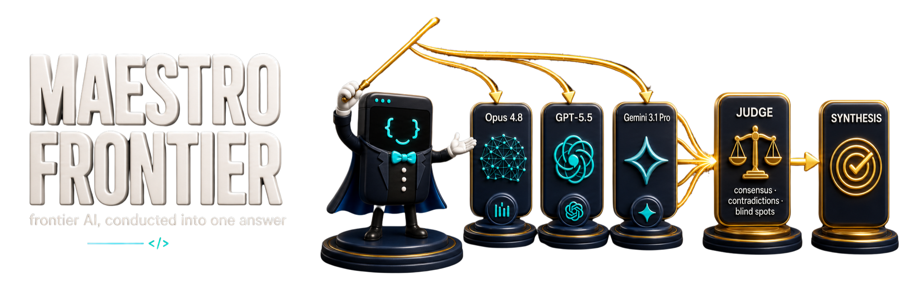
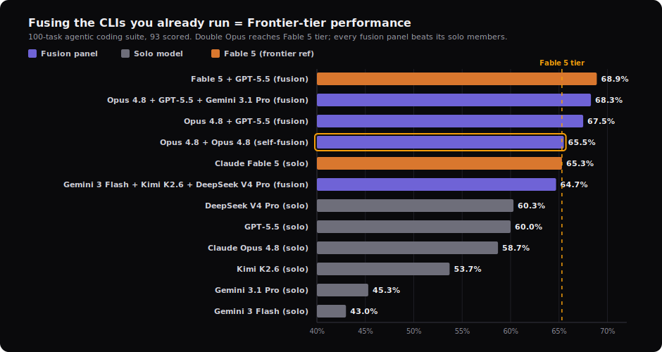

<p align="center">
  
</p>

<p align="center">
  <strong>Achieve Frontier AI performance in your CLI</strong> — by fusing the model CLIs you already run. Fan one prompt across a panel of 1-8 of your local CLIs in parallel, have a judge model you pick read every answer into a structured analysis, then a synthesizer you pick write one grounded answer that does not majority-vote. On a 100-task benchmark, every fusion panel outscored its individual member models. It runs on Maestro's discipline layer: verified done-claims, surgical scope, and a research-backed multi-agent gate.
</p>

<p align="center">
  <a href="https://github.com/mbanderas/maestro/actions/workflows/ci.yml"></a>
  <a href="https://github.com/mbanderas/maestro/tags"></a>
  <a href="https://opensource.org/licenses/MIT"></a>
  
</p>

<p align="center">
  <a href="#the-frontier-engine"></a>
  
  
  
  <a href="#contributing"></a>
</p>

<p align="center">
  <sub>13 fixture tasks &middot; 123 valid A/B runs &middot; 11 voids excluded &amp; re-run &middot; 6 hooks, all tested &middot; ~8 KB always-on kernel &middot; 2-line plugin install</sub>
</p>

> **⚡ Universal install** — paste this to your coding agent (Claude Code, Gemini, Codex / Codex Desktop, Cursor, Cline, Windsurf, …) and it installs the full Maestro your runtime can run — orchestration doctrine, the Frontier engine, and on Claude Code the whole plugin:

```text
Install Maestro into this repository — the orchestration doctrine, the Frontier fusion engine,
and, on Claude Code, the full plugin machinery. Source of truth: the repo at
https://github.com/mbanderas/maestro (raw base https://raw.githubusercontent.com/mbanderas/maestro/main/).

1. Doctrine — every runtime. Put AGENTS.md in the project root; if one already exists, append
Maestro's content below what is there and never overwrite or delete it. Add my runtime adapter —
CLAUDE.md (Claude Code), GEMINI.md (Gemini), or .cursorrules (Cursor); Codex needs only AGENTS.md.
Merge the adapter into any existing file the same append-only way, and make the adapter — not
AGENTS.md — import @AGENTS.md at the top (Cursor has no imports, so paste the kernel in). Also
fetch docs/orchestration.md into docs/ — the doctrine loads the full S2-S6 multi-agent protocol
from it on demand.

2. Machinery.
- Claude Code: run `/plugin marketplace add mbanderas/maestro` then `/plugin install maestro@maestro`.
Those two lines wire the enforcement hooks, /maestro:* commands, skills, status line, and the
Frontier engine with auto-run. That is the entire install — you are done.
- Any other CLI (Codex, Cursor, Gemini, Cline, Windsurf, …): run
`npx github:mbanderas/maestro install --target auto --project .` from the project root — it
fetches the engine, copies the integration files, and verifies the install in one step. Zero
dependencies; works today from GitHub before any npm publish. Once Maestro is published to
npm, `npx @maestrofrontier/frontier install --target auto` is the equivalent shorthand. Confirm with
`maestro frontier status` (or `node bin/maestro.cjs frontier status` if maestro is not yet on
PATH). For a /frontier slash command, the install copies integrations/cursor/commands/frontier.md
to .cursor/commands/ (Cursor) or integrations/codex/prompts/frontier.md to ~/.codex/prompts/
(Codex). The plugin's enforcement hooks, /maestro:* commands, and skills can't load outside Claude
Code, so the doctrine from step 1 is what governs the agent there. Per non-Claude tool add
--scope <tool> (e.g. --scope codex, --scope cursor) so armed state stays per-CLI-global.

Leave Frontier off (its default) until I arm it — /maestro:frontier on Claude Code, or
`maestro frontier mode fusion --preset opus-gpt` elsewhere.
```

---

> **Agents:** start with [`docs/agent-map.md`](docs/agent-map.md) for
> repo navigation. This README is the user-facing product narrative.

## The Frontier Engine

**Achieve Frontier AI performance in your CLI.** Maestro Frontier is an
opt-in, zero-dependency multi-CLI fusion engine built from the AI CLIs
already on your machine. It fans a prompt out to a parallel panel of any
1-8 local CLIs you pick, has a judge model you choose read their answers
into a structured analysis (consensus, contradictions, unique insights,
blind spots; compare, not merge), then has a synthesizer you choose write
a grounded answer that does not majority-vote. The payoff is measured: on
a 100-task benchmark, fused panels beat the best of their individual
members — fusing the CLIs you already run buys frontier-tier results. It
is the project's new default identity; the doctrine, hooks, skills, and
benchmarks are unchanged; the discipline layer is its foundation.

<p align="center">
  
</p>

<p align="center">
  <sub>Fusion vs solo on a 100-task suite (93 scored). Every fusion panel beats its own member models, and the strongest fusion — Fable 5 + GPT-5.5 — leads the field. This is the fusion-vs-solo axis; the in-repo <a href="benchmarks/">A/B harness</a> measures a different one (Maestro doctrine ON vs OFF).</sub>
</p>

<p align="center">
  
</p>

The pipeline above is the engine's whole architecture: fan out to a
parallel panel, a judge model that compares the answers (it does not
merge them), then a grounded synthesis.

It ships with the plugin and is driven by `/maestro:frontier`. Three
modes, switched at will, **`off` by default** so installing or
upgrading changes nothing until you opt in. **Arming it — `single` or
`fusion` — makes it auto-run on every prompt**: a `UserPromptSubmit`
hook routes each prompt through the engine and the live session relays
the synthesized answer. `off` is the disable path.

| Mode | Behavior |
|---|---|
| `off` | Normal Maestro. Engine never invoked; zero behavior change. The default, and the way to disable auto-run. |
| `single <model>` | Auto-runs every prompt through one local CLI and relays its answer. No panel, no judge, no synth. |
| `fusion <preset>` | Auto-runs every prompt through your panel -> a judge model's analysis -> a grounded synthesis, with graceful degradation and one-level recursion bounds. |

```text
/maestro:frontier status                       # show current mode
/maestro:frontier single opus                  # arm one-CLI auto-run
/maestro:frontier fusion opus-gpt              # arm panel auto-run (Opus + GPT-5.5)
/maestro:frontier run "your prompt here"       # manual one-off (armed modes also auto-run)
/maestro:frontier off                          # disable auto-run; back to normal Maestro
```

<p align="center">
  
</p>

Presets define the panel; the judge and synthesizer default to Opus 4.8
(`claude -p`), and you override either with `--judge` / `--synth`:

- **`opus-duo`**: two independent Opus runs, isolating the synthesis lift.
- **`opus-gpt`**: Opus + GPT-5.5 (via `codex exec`); the recommended default for bounded spend.
- **`gpt-duo`**: two GPT-5.5 runs whose judge and synthesizer also run on GPT-5.5: a Codex-only fusion that needs no `claude`.
- **`frontier-trio`**: Opus + GPT-5.5 + Gemini 3.1 Pro (via `gemini -p`).
- **`custom`**: 1-8 of the known models.

Three model CLIs ship as adapters today: Opus 4.8 (`claude`), GPT-5.5
(`codex`), and Gemini 3.1 Pro (`gemini`). Kimi, DeepSeek, GLM, and Qwen
adapters follow in an update soon.

Pass `--judge <model>` / `--synth <model>` to run those stages on any
model for any preset (e.g. `--judge opus --synth gpt-5.5`), so you can mix
the panel and the judge/synth freely. Degradation is graceful: a partial
panel failure still returns a synthesis plus `failed_models`; a judge
failure synthesizes from the raw responses; a hard failure returns a typed
`failure_reason`. A `FUSION_DEPTH` guard bounds recursion to one level.

Honest scope, measured rather than implied: the **engine is built,
unit-tested (degradation, recursion, budget, anti-majority all covered),
and verified end-to-end on real runs of `single` mode and the
`opus-gpt`, `opus-duo`, and `frontier-trio` presets**. The `gpt-duo`
preset and `--judge`/`--synth` selection share that same code path and
are unit-tested, but not yet live-run. The quality *lift* of local fusion
is **measured, not asserted**: on a 100-task suite (93 scored, chart
above) every fusion panel outscored its own member models, with the
strongest fusion leading the field. That fusion-vs-solo result is a
separate axis from the in-repo A/B harness, which measures Maestro
doctrine ON vs OFF; numbers are never mixed across the two.
Operational caveats recorded in the risk burndown: headless web access
differs per CLI (Codex confirmed live; Claude and Gemini are gated
`webTools:false` in this build), and each cold `claude -p`
panel/judge/synth call is non-trivial in cost; use small prompts, and
prefer `opus-gpt` to bound spend. The budget cap is opt-in
(`tokenBudget`, default disabled). The engine is zero-dependency
CommonJS under [`frontier/`](frontier/); each CLI is resolved from your
`PATH` (`claude`, `codex`, `gemini`). Binary overrides and the full
operational reference are in
[`commands/frontier.md`](commands/frontier.md#binary-overrides).

<p align="center">
  
</p>

## What You Get

<p align="center">
  
</p>

Frontier is the headline; the discipline layer beneath it is what runs on
every task. Drop two markdown files into your repo and your agent gains
five things:

1. **Done means done.** Completion reports carry a verification status (`VERIFIED` / `UNVERIFIED` / `FAIL`) backed by an actual type-check, lint, or test run, with an optional hook enforcing it structurally.
2. **It stays in its lane.** Surgical-scope rules: every changed line traces back to what you asked for: no drive-by refactors, no formatting sweeps, no deleting code it couldn't verify was dead.
3. **Long runs that land.** Overnight tasks and recurring loops get checkpoint artifacts, explicit end conditions, iteration caps, and re-grounding rules. This repo's own benchmark loops run on exactly these rules.
4. **Multi-agent only when it pays.** A counted Decision Gate routes work single-agent by default and demands an explicit verdict line before the first edit; orchestration stays behind it.
5. **Receipts.** A reproducible A/B benchmark harness ships in-repo, with our own retractions and nulls. Rerun every number yourself.

<p align="center">
  
</p>

The price, measured rather than implied: ON spends about 10% more than a
clean agent on a 10-module refactor and 38% more on a 16-file feature
(n=9 medians, t08/t12 below); you are buying verification and
auditability, not speed. The overhead is behavioral, not byte-weight: a
kernel rewrite cut always-on bytes 41% and fixed status reporting
(12/12 vs 3/30) with no measurable cost change. The premium earns its
keep on unattended work (overnight loops, scheduled runs, CI agents)
where nobody reads the 3am transcript and the close-out claim is all you
have.

That regime is not hypothetical: Maestro runs under its own rules. The
four most recent maintenance loops ran unattended on the S10 long-horizon
doctrine, with checkpoint artifacts and pre-declared budget ceilings, and
together made 75 benchmark runs for $30.12 against $47 in caps, produced 0
voided runs, and shipped the retractions you can read below with no human
in the loop. Output-style compression (terse-reply tools) is orthogonal
and worth ~1% of agentic spend; Maestro will not grow a kernel toggle for
it. The whole design rests on [peer-reviewed
research](https://marklaursen.com/blog/why-your-multi-agent-ai-system-keeps-failing)
showing **79% of multi-agent failures come from coordination, not model
capability**, and that **three optimized agents outperform seven**;
adding agents usually makes things worse, so Maestro makes the single
agent you already have rigorous by default and holds multi-agent
coordination behind a counted gate.

## The Discipline Layer It Runs On

Frontier runs on this. It is the part this repo actually benchmarks: a
verification-first discipline layer that applies to every task, fusion or
not.

<p align="center">
  
</p>

- **Universal Rules**: verification gates, status vocabulary, surgical scope, edit safety, context economy; applied to every task in both modes, including one-line fixes.
- **Decision Gate**: counts the work and emits a verdict line (`GATE: files=<n> concerns=<m> -> ...`) before the first edit. Most tasks stay single-agent.
- **Planner**: decomposes complex tasks into parallel and sequential subtasks with boundaries and acceptance criteria.
- **Specialists**: execute focused subtasks with scoped context, hard-capped at 4 per parallel group (DyLAN and agent-scaling findings).
- **Cross-Talk Routing**: detects when one specialist's output affects another and routes the minimum necessary context.
- **Staff Engineer Review**: adversarial final verification for contradictions, breakage, and architectural drift.
- **Long-Horizon Operation**: checkpoint artifacts, self-pacing, and explicit end conditions for recurring or multi-session runs; exits graded by a fresh-context verifier, never self-assessed.

<p align="center">
  
</p>

**How it works:**

1. You give your AI coding agent a task as normal.
2. The Decision Gate counts the work and emits a verdict line; most tasks run single-agent with no coordination overhead.
3. Single-agent work follows the Universal Rules: scoped edits, verification before any completion claim, an honest status token at the end.
4. Work that crosses the gate's thresholds goes Planner -> Specialists -> adversarial Staff Engineer review.
5. Long or recurring runs follow the Long-Horizon rules: checkpoint artifacts, explicit end conditions, iteration caps.
6. You get a result with a verification status you can act on, not a vibe.

The specialist manifest (S3) and cross-talk handoff packet (S4/S6) also ship as machine-readable JSON Schemas in [`schemas/`](schemas/) for tooling. The prose doctrine remains the source of truth.

## Quick Start

Maestro installs as plain markdown files your AI agent reads on startup. No packages, no build steps, no SDK. Download the files for your runtime into the project root and your agent picks them up automatically.

| Runtime | Files to add |
|---|---|
| Claude Code | [`AGENTS.md`](AGENTS.md) + [`CLAUDE.md`](CLAUDE.md) |
| Gemini | [`AGENTS.md`](AGENTS.md) + [`GEMINI.md`](GEMINI.md) |
| Codex | [`AGENTS.md`](AGENTS.md); see [Maestro on Codex](docs/codex.md) |
| Cursor | [`.cursorrules`](.cursorrules) |
| GitHub Copilot | [`AGENTS.md`](AGENTS.md); nearest `AGENTS.md` in the directory tree wins, and a root `CLAUDE.md` or `GEMINI.md` also works |
| Cline | [`AGENTS.md`](AGENTS.md); native support (also auto-detects `.cursorrules`) |
| Windsurf | [`AGENTS.md`](AGENTS.md); root file is always-on, processed by the Rules engine |

> **Already have a `CLAUDE.md`, `AGENTS.md`, or `.cursorrules`?** Don't overwrite them, you'll lose your project context. The per-runtime steps below show how to merge Maestro into an existing setup.

### Claude Code

**Option A, plugin (hooks + context-bar command, one step).** Maestro
is an installable Claude Code plugin; the repo is its own marketplace:

```text
/plugin marketplace add mbanderas/maestro
/plugin install maestro@maestro
```

The plugin auto-wires all five enforcement hooks (subagent guard, loop
guard, phase-scope guard, gate reminder, opt-in gate telemetry) and the
`/maestro:context-bar` command. Two things it cannot do for you:
the doctrine files (`AGENTS.md`/`CLAUDE.md`) still go in your project
root (Option B), and the status line script still needs a one-line
`statusLine` settings entry (see [`docs/context-bar.md`](docs/context-bar.md));
plugins cannot set the main status line.

**Option B, plain files (doctrine only, zero machinery):**

```bash
curl -O https://raw.githubusercontent.com/mbanderas/maestro/main/AGENTS.md
curl -O https://raw.githubusercontent.com/mbanderas/maestro/main/CLAUDE.md
```

Claude Code reads `CLAUDE.md` on startup. The `@AGENTS.md` import inside it pulls in the orchestration doctrine. Your next task routes through Maestro's Decision Gate.

**Already have a `CLAUDE.md`?** Don't overwrite it. Instead, download just `AGENTS.md` and add `@AGENTS.md` to the top of your existing `CLAUDE.md` to import the doctrine. You can optionally merge the runtime rules from Maestro's [`CLAUDE.md`](CLAUDE.md) into yours.

**Optional:** Maestro also ships a context-window progress bar for the Claude Code status line; see [`docs/context-bar.md`](docs/context-bar.md).

### Gemini

```bash
curl -O https://raw.githubusercontent.com/mbanderas/maestro/main/AGENTS.md
curl -O https://raw.githubusercontent.com/mbanderas/maestro/main/GEMINI.md
```

**Already have a `GEMINI.md`?** Don't overwrite it. Download just `AGENTS.md` and add `@AGENTS.md` to the top of your existing `GEMINI.md`. You can optionally merge the runtime rules from Maestro's [`GEMINI.md`](GEMINI.md) into yours.

### Codex

```bash
curl -O https://raw.githubusercontent.com/mbanderas/maestro/main/AGENTS.md
```

Codex reads `AGENTS.md` directly; no adapter file needed.

**Already have an `AGENTS.md`?** Don't overwrite it: that file likely contains your project context. Instead, append the contents of Maestro's [`AGENTS.md`](AGENTS.md) to your existing file, or paste it into a section of your `AGENTS.md` so Codex reads both your project context and the orchestration doctrine.

### Cursor

```bash
curl -O https://raw.githubusercontent.com/mbanderas/maestro/main/.cursorrules
```

**Already have a `.cursorrules`?** Don't overwrite it. Cursor does not support file imports, so append the contents of Maestro's [`.cursorrules`](.cursorrules) to your existing file.

## Runtime Adapters

Maestro separates **portable orchestration doctrine** from **runtime-specific adapters**. The core logic lives in `AGENTS.md` and works across any agent runtime; adapters are thin wrappers that import it and add only what is runtime-specific.

| File | Role | What it adds |
|---|---|---|
| `AGENTS.md` | Portable core | Full orchestration doctrine, runtime-agnostic |
| `CLAUDE.md` | Claude Code adapter | Subagent/team routing, hooks, context limits, tool scoping, long-horizon mapping (/loop, schedules) |
| `GEMINI.md` | Gemini adapter | Execution mapping, instruction precedence, verification notes, long-horizon note |
| `.cursorrules` | Cursor adapter | Kernel copy (Cursor does not support imports); full S2-S6 in docs/orchestration.md |
| [`docs/codex.md`](docs/codex.md) | Codex guide | AGENTS.md precedence and 32 KiB cap, Codex subagent mapping, Automations long-horizon mapping (Codex reads `AGENTS.md` natively) |

GitHub Copilot, Cline, and Windsurf read `AGENTS.md` directly, so the portable core works there with no adapter. Maestro's always-on kernel (`AGENTS.md`) is ~8 KB, under Windsurf's 12,000-character limit and roughly a quarter of Codex's 32 KiB budget; the full multi-agent protocol loads on demand from `docs/orchestration.md`.

**Subagents vs Agent Teams (Claude Code):** Maestro's `CLAUDE.md` adapter
routes automatically. **Subagents** run within one session and report
results to the parent; this is the default for narrow independent work.
**[Agent teams](https://code.claude.com/docs/en/agent-teams)** coordinate
multiple sessions with peer-to-peer messaging, used only for long-running
parallel workstreams, competing-hypothesis debugging, or cross-layer
builds. Agent teams are experimental and Claude Code-only.

## Claude Code Tools

Optional Claude Code machinery; full install steps in the linked docs.

- **Verification Hook**: a `SubagentStop` hook enforcing S7.3 structurally: warns when a file-modifying subagent skips a checker or omits a status token. Never blocks. [`docs/hooks.md`](docs/hooks.md)
- **Hook Pack**: five more zero-dependency hooks (doctrine guard, loop guard, phase-scope, gate reminder, opt-in gate telemetry) enforcing the rest of the doctrine. [`docs/hooks.md`](docs/hooks.md)
- **Context Bar**: a status-line context-window progress bar that shifts green to amber to red and detects the model's window (including the 1M Opus tier). [`docs/context-bar.md`](docs/context-bar.md)
- **Terse Mode + Compress**: opt-in output-token reduction (`/maestro:terse`) and a memory-file compressor (`/maestro:compress`), adapted from the MIT-licensed Caveman plugin. [`docs/context-bar.md`](docs/context-bar.md)
- **Settings**: `/maestro:settings` changes any toggle in one line (`set terse off`, `frontier fusion opus-gpt`, `help`) or opens a keyboard picker with no arguments (the `AskUserQuestion` selector, not the built-in `/model` widget, which plugins cannot render), plus a portable `node settings/cli.cjs status|list|help|set` for Codex and any other CLI, over the terse, frontier, and context-bar toggles. [`docs/settings.md`](docs/settings.md)

## Commands & Settings

Every Maestro slash command in Claude Code is namespaced `/maestro:<name>`. On Codex and other CLIs without slash commands, the same actions run through the scripts noted below.

| Command | What it does | Usage |
|---|---|---|
| `/maestro:settings` | See or change all toggles. With arguments it runs the change directly; with no arguments it opens a keyboard picker. | `/maestro:settings`, `… status`, `… list`, `… help`, `… set terse off`, `… frontier fusion opus-gpt` |
| `/maestro:frontier` | Drive the local multi-CLI fusion engine: switch mode, pick a model/preset, or run a prompt through it. | `… off`, `… single opus`, `… fusion opus-gpt`, `… status`, `… run "<prompt>"` |
| `/maestro:terse` | Switch terse output mode for the session (off by default). | `… lite`, `… full`, `… ultra`, `… off` |
| `/maestro:context-bar` | Toggle the status-line context progress bar (and the Maestro badges on it). | `/maestro:context-bar`, `… on`, `… off` |
| `/maestro:compress <file>` | Rewrite a natural-language memory file in terse form to cut input tokens; keeps a backup and validates deterministically. | `… path/to/NOTES.md` |

### Settings toggles

`/maestro:settings` and the portable `node settings/cli.cjs` cover three persisted toggles:

| Toggle | Values | What it controls |
|---|---|---|
| `terse` | `off`, `lite`, `full`, `ultra` | Output-token reduction. Shows an amber level badge (`ULTRA`) on the status bar. |
| `frontier` | `off`; `single:` `opus` / `gpt-5.5` / `gemini`; `fusion:` `opus-duo` / `opus-gpt` / `gpt-duo` / `frontier-trio` / `custom`, each with optional `--judge` / `--synth` | The local fusion engine. When armed it auto-runs on every prompt. The blue `ƒ` panel badge means auto-run is on: `ƒO+C`, `ƒO+C+G`, `ƒ✦3` (`O`=Opus, `C`=ChatGPT/GPT-5.5, `G`=Gemini). |
| `context-bar` | `on`, `off` | The status-line context-window progress bar. |

Portable everywhere, Codex included: `node settings/cli.cjs status | list | help | set <key> <value>` (frontier also takes `--judge`, `--synth`, `--models a,b,c`). Full references: [`docs/settings.md`](docs/settings.md) and [`docs/context-bar.md`](docs/context-bar.md).

## Updating Maestro

Maestro no longer pins a plugin version. The marketplace always resolves to the latest `main`, so updating is a single refresh — no version bump needed in any file.

### Claude Code (recommended)

`/maestro:update` is the one-command path — it pulls the latest marketplace code, reports what changed, and tells you when to reload:

```text
/maestro:update
```

It can't run the reload for you (a slash command can't invoke another slash command), so it ends by prompting you to run `/reload-plugins` (or restart). The manual equivalent is two steps:

```text
/plugin marketplace update maestro
/reload-plugins
```

`/reload-plugins` applies the update in the running session; if Claude Code warns that a restart is required, restart it. Non-interactive equivalent of the pull: `claude plugin marketplace update maestro`. You can also enable marketplace auto-update so the local clone refreshes automatically — check Claude Code's plugin settings.

> **Note:** There is no `/plugin update <name>` command in Claude Code. Use `/maestro:update`, or `/plugin marketplace update maestro` + `/reload-plugins`.

### Codex / Cursor (portable installs, no plugin system)

Run `/update` if your integration file exposes it, or update manually:

- **Git clone:** `git pull` inside the Maestro clone directory.
- **Downloaded copy:** re-run `npx github:mbanderas/maestro install --target auto --project .` from the project root, or re-download the tarball and re-copy `frontier/`, `bin/maestro.cjs`, plus your integration command file (`integrations/codex/prompts/frontier.md` or `integrations/cursor/commands/frontier.md`) from the latest `main`.

### Gemini / other CLIs

The same portable manual steps apply: re-pull or re-copy `frontier/` and the relevant integration file from `main`. If your CLI supports custom commands and you have a `/update` wired, run that instead.

## When to Use Maestro

The discipline layer (verification, scope, honest status) applies to every task from a one-line fix upward. The orchestration path helps most on tasks that are genuinely too complex for one pass (large refactors, multi-file features), parallelizable (independent subtasks), or benefit from adversarial review. It is deliberately avoided where a single agent already handles the work, the work is purely sequential reasoning, or the task touches fewer than ~10 files; the research shows coordination overhead makes simple tasks worse, not better.

### Why Not CrewAI / LangGraph / AutoGen?

| | Maestro | CrewAI / LangGraph / AutoGen |
|---|---|---|
| **Setup** | Two lines (`/plugin install`) or copy a folder, done | Install packages, write Python/TS, configure agents |
| **Dependencies** | Zero | Framework + SDK + runtime |
| **Where it runs** | Inside your existing AI coding agent | Standalone process you build and deploy |
| **Agent count** | Hard cap at 4 parallel (research-backed) | Unlimited (user decides) |
| **Default behavior** | Single-agent unless complexity warrants multi | Always multi-agent |
| **Design philosophy** | Fewer agents, structured coordination | More agents, flexible topologies |

Maestro is not a framework. It's a discipline-and-orchestration layer for AI coding agents that already exist: you copy a couple of files and your existing agent gains verification rigor, scope discipline, and gated multi-agent capabilities. If you need a standalone multi-agent application with custom tools, APIs, and deployment pipelines, use a framework.

## Benchmarks

Maestro ships a reproducible A/B harness in [`benchmarks/`](benchmarks/):
thirteen fixture tasks, a runner for Windows and macOS/Linux (no deps;
the macOS/Linux script needs `jq`), and a deterministic `verify.cjs`
checker per task. Each task runs Maestro ON (doctrine files present) vs
OFF (absent) under an isolated `CLAUDE_CONFIG_DIR`, with the checker
**hidden from the agent until the run ends** (visible oracles inflate
pass rates 20-60%, arXiv:2602.10975).

<p align="center">
  
</p>

Honest reading: **Maestro ON has never beaten OFF on success rate in any
measured cell**; at n=9, t09 is exactly tied (8/9 each) and t08 and t12
are 9/9 both modes. The early efficiency story did not survive
replication: the t12 and t08 n=3 wall, turn, and token gains were all
retracted at n=9, and the only unreplicated positives left standing
(Gemini t08, the t11 pilot) are flagged as such. The full n=3 -> n=9
reversal arithmetic is in
[`docs/benchmarks.md`](docs/benchmarks.md#retractions). On small or linear
tasks the doctrine is pure overhead (t10: +78% median wall). t09 separates
*models* more than modes: gemini-3.1-pro-preview passes 1 of 6 valid runs,
gpt-5.4-mini 4/4, sonnet ~8-in-9. Small samples throughout; no
significance claims.

The one new directional signal is on a different axis. **t14**, a
checker-less trap task with a non-obvious correctness property, holds both
arms at **6/6 pass** while the honesty metric `claim_consistent` runs
**OFF 1/6 vs ON 4/6** and `target_smoke_tested` **OFF 0/6 vs ON 2/6**, at
ON median cost **$0.1930** vs OFF **$0.1501** (about **+29%**). The
`status_token` axis is excluded; OFF was never taught the S7.3
vocabulary. Per the frozen prereg this is **directional only, not
confirmatory** (n=6 is exploratory; a grounded effect needs n>=9): Maestro
buys more honest completion behavior on a trap task, at higher cost; paid
for by the premium, not recovered.

Key findings:

- **No success-rate lift.** ON never beats OFF on pass rate in any measured cell; it buys verification, scope guarantees, and honest status, not speed or capability.
- **Weak-model rescue: not measurable.** Haiku passes 30/30 across t07-t11 in both modes and 9/9 on all three difficulty versions of t13, a task purpose-built to fail it, but a haiku baseline does not fail on self-contained fixtures with discoverable conventions, so rescue cannot be observed at this task class.
- **The gate speaks, prose alone does not spawn.** Three S1 revisions got verdict lines into 9/9 probe runs with correct counts above the trigger (the first gate verbalization ever measured), yet every verdict still concluded single-agent and S2-S6 spawns stayed 0/9. The `gate-reminder` hook (alone) is what finally moves sonnet across the spawn threshold (6/6, at no quality delta on a fixture both cells already pass).
- **The verdict line binds.** Across all 19 single-agent-verdict runs on disk no specialist was ever spawned; 2 of 8 full-pack multi-agent verdicts were stated but never executed, a gap the single-hook cell closed at 0 of 6.
- **Compliance deltas are null at these tiers.** Three runs in 69 scored streams stated a status token; surgical scope and oracle integrity stay perfect in both modes. Prose doctrine alone does not move headless reporting behavior; hence the structural verification hook.

Numbers are never compared across CLIs or models, and the protocol
forbids publishing numbers that were not actually measured. Earlier
same-day t01-t06 results were taken **before** the hidden-oracle fix and
are kept only as labeled upper bounds, not comparable to the cells above.

Full data, retractions, and methodology -> [`docs/benchmarks.md`](docs/benchmarks.md).

## Research Foundation

Maestro's architecture is grounded in 700+ sources across computer science, library science, safety engineering, and knowledge theory. The key papers:

| Paper | Year | Venue | Key Finding |
|---|---|---|---|
| [MAST](https://arxiv.org/abs/2503.13657) | 2025 | NeurIPS Spotlight | 41-87% failure rates; 79% from coordination |
| [DyLAN](https://arxiv.org/abs/2310.02170) | 2024 | COLM | 3 agents outperform 7; dynamic topology selection |
| [Towards a Science of Scaling Agent Systems](https://arxiv.org/abs/2512.08296) | 2025 | arXiv (Google/MIT) | 260 configs; architecture-task fit dominates; sequential tasks degrade 39-70% |
| [Agent Scaling via Diversity](https://arxiv.org/abs/2602.03794) | 2026 | arXiv | 2 diverse agents match 16 homogeneous; diversity, not headcount, drives gains |
| [LoopTrap](https://arxiv.org/abs/2605.05846) | 2026 | arXiv | Termination poisoning: loop end-conditions are an attack surface; hard caps mitigate |
| [MetaGPT](https://arxiv.org/abs/2308.00352) | 2023 | - | Structured handoffs score 3.9/4 vs unstructured 2.1/4 |
| [Voyager](https://arxiv.org/abs/2305.16291) | 2023 | NeurIPS | Skill library pattern for capability organization |
| [GTD](https://arxiv.org/abs/2504.05767) | 2025 | arXiv | 0.3% degradation under failure with redundant topologies |
| [SELFORG](https://arxiv.org/abs/2502.11811) | 2025 | arXiv | Shapley-based contribution estimation |
| [DRACO](https://arxiv.org/abs/2602.11685) | 2026 | arXiv | Deep-research benchmark reviewed for fusion; fused panels outscored their solo members |

For the full analysis, read [Why Your Multi-Agent AI System Keeps Failing](https://marklaursen.com/blog/why-your-multi-agent-ai-system-keeps-failing).

## Contributing

Contributions are welcome. Before opening a PR:

1. Read the research foundation. Maestro's constraints (4-agent cap, Decision Gate bias toward single-agent) are intentional and research-backed
2. Keep it zero-dependency: no npm packages, no external imports
3. Test with real tasks across Claude Code, Gemini, Codex, and Cursor
4. Docs changes: run `npx --yes markdownlint-cli2` from the repo root (no install footprint; config in `.markdownlint-cli2.jsonc`)

If you have benchmarks, case studies, or research that challenges or extends the current architecture, open an issue. The design should evolve with evidence.

## Related Projects

- **[Govyn](https://github.com/govynAI/govyn)**: Open-source AI agent governance proxy. Maestro orchestrates your agents; Govyn ensures they never hold real API keys, stay within budget, and follow policy. They are designed to work together.

## Community

Using Maestro Frontier, or running the discipline layer on your own agent? [Open a discussion](https://github.com/mbanderas/maestro/discussions) or [file an issue](https://github.com/mbanderas/maestro/issues).

## License

MIT
